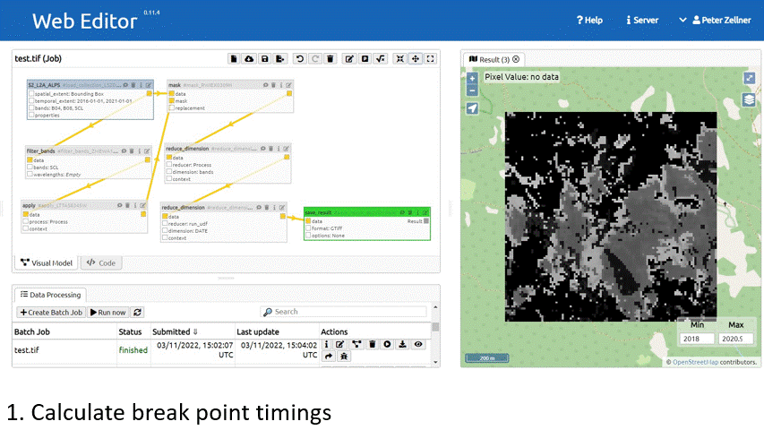

# UC2: Timeseries Break Detection

## Description
This use case shows how R UDFs are used to do advanced time series modelling which is not available through native openEO processes. 
In this use case the `bfast::bfastmonitor` break detection method is chosen to detect breaks in forested areas. 
It demonstrates a blue-print how to apply time series modelling on  a single pixel time series. 
Additionally, it is shown how the `openEO` context parameter can be used to
parametrize a UDF without recoding it. This UDF allows to pass on bfast parameters
such as level, value and start_monitor to parametrize the functin without recoding the UDF.
Other methods could also be used by replacing the function in the UDF, e.g. for phenology analysis 
or time series smoothing.

## Benchmarking
### Experiment
Four ways of producing the bfast forest break detection are carried out on two different AOIs. This is mainly done for benchmarking and for demonstrating the different ways of interacting with openEO platform, the R-Client and the R-UDF library. 

Four ways:
* local_r: The udf is run directly in R
* local_udf: The udf is run on a local instance of the UDF service
* openeo_eurac: The udf is run on Eurac Researchs openEO instance
* openeo_platform: The udf is run on openEO platform (VITO dev backend) 

Two AOIs:
* test: A small test area within the vaja storm region for small scale testing. 100 by 100 pixels (10000 pixels), 1 km2
* vaja: the area where the vaja storm hit in 2018. This area is also used in the ECO4Alps project to test the bfast service there. 2238 by 2670 pixels (6 mio. pixels), 600 km2

The data set:
* Sentinel-2 L2A collection
* Cloud masking using S2 scene classification
* 2016 to 2020
* 10 m resolution

### Timing
#### Test

* local_r
  * processgraph_data_local.R: 216 s (26126 cpusec)
  * run_local_r_udf.r: 34 s
  * total: 250 s
* local_udf 
  * processgraph_data_local.R: 216 s (26126 cpusec)
  * run_bfast_udf.ipynb: 78 s
  * total: 294 s
* openeo_eurac
  * processgraph_eurac_test.json / processgraph_eurac.RMD: 118 s
* openeo_platform
  * processgraph_vito_test.json / processgraph_vito.RMD: XX s

#### Vaja

* local_r
  * processgraph_data_local.R: 4775 s (1.3 h) (933550 cpusec)
  * run_local_r_udf.r: 4.8 h
  * total: 6.1 h
* local_udf 
  * processgraph_data_local.R: 4775 s (1.3 h) (933550 cpusec)
  * run_bfast_udf.ipynb: XX h (>3h)
  * total: XX h
* openeo_eurac
  * processgraph_eurac_vaja.json 
* openeo_platform
  * processgraph_vito_vaja.json

## Results
### Compared to ECO4Alps
Currently the results are not refined with the magnitude layer of bfast

### On the fly calculation on Eurac backend
The results of the use case can be computed directly on the fly on the 
Eurac backend by using this process graph (and reducing the extent to a relevant forest patch).
This allows interactive and on the fly monitoring of forest patches. 
The process graph is masking clouds, calculating the NDVI, detecting breakpoints in the timeseries, 
estimating the magnitude of change and finally keeping the most probably detected breaktpoint timings.

## User Guide

* Create the process graph for preparing your NDVI time series

* How to write the UDF
Note: We are using `udf_chunked()`  because `bfastmonitor()` is running on arrays only. 
It is not optimized for matrix usage like uc1 ml for example.

* How to insert the UDF into the process graph

## Outlook
* The `bfast` process can be replaced by phenology packages like `phenopix` to study phenology. Which is also a pixel based time series modelling approach.
* The processgraph that calculates breakpoints and masks them with the magnitude can be exposed as a User Defined Process (UDP). Any user can then use it and parametrize it to his liking (e.g. start of the modelling period, threshold for the magnitude masking, etc.)

## Dependencies

### Running locally in R (without UDF)

### Running a local UDF backend

### Running on an openEO backend
* R version
* RStudio version
* all packages and versions
