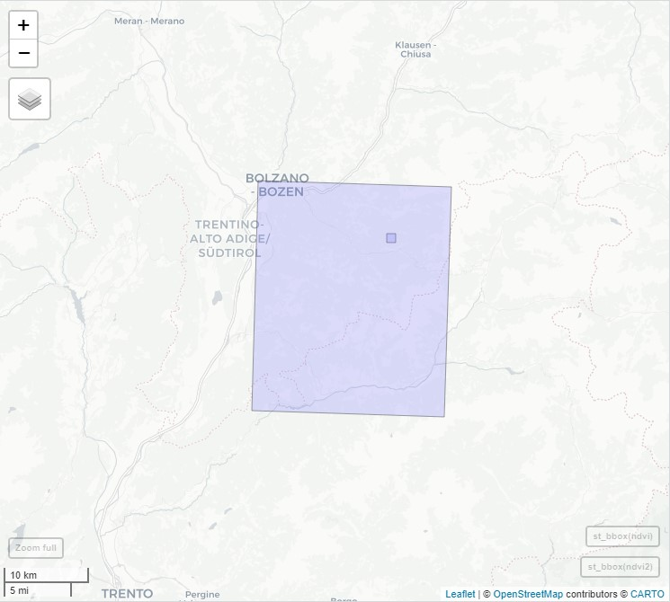
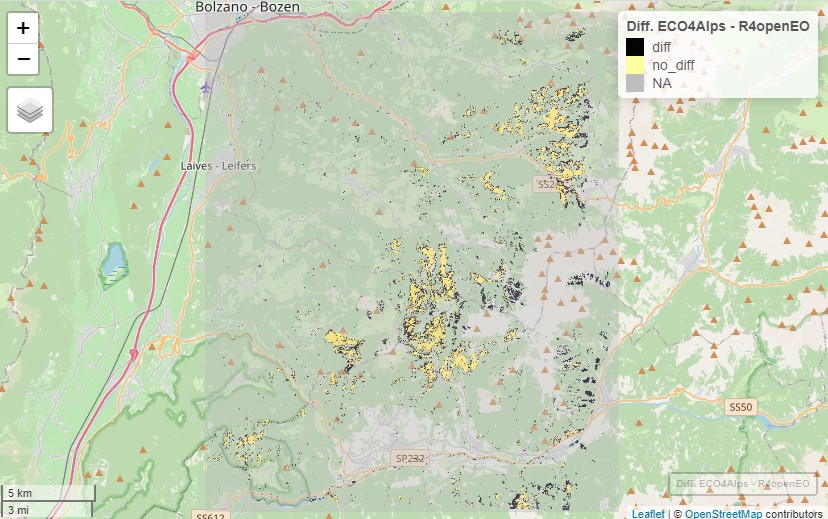
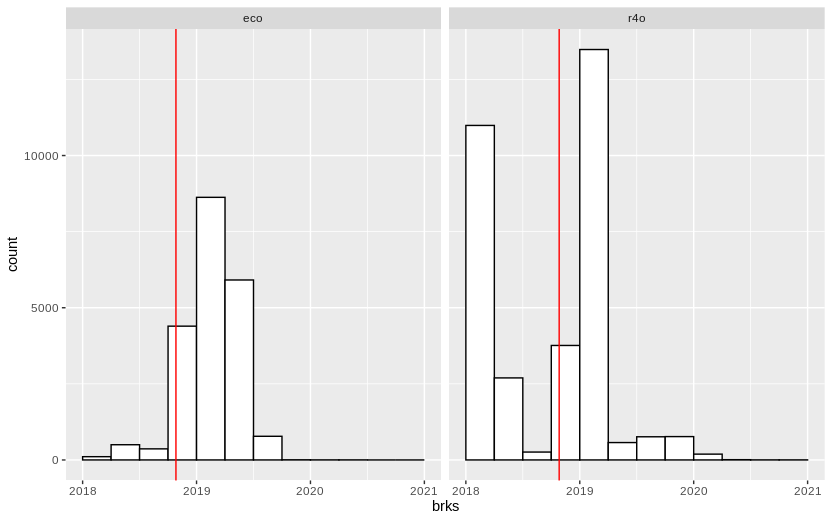

# UC2: Timeseries Break Detection

:bulb: **Timeseries modelling on pixel level via R-UDFs**

## Description

Mountain forests produce a large number of ecosystem services that will
likely be affected by climate change. In light of the possible rise in
extreme climatic events, changes in the forest disturbance regime will
be very detrimental to the economic system, protection against natural
hazards and biodiversity. The extreme weather events in Northern Italy
are a good example to underline the frequency and scale of these
impacts: In spring 2017, vast areas totalling 800 ha of pines dried up
in the Vinschgau Valley as a result of a severe drought in the previous
two years combined with an increased vulnerability towards pest
infestations. The north-eastern regions of Italy were hit by a storm
event in autumn 2018 with wind gusts exceeding 200 km/h. The registered
damage summed up to 42'500 ha and resulted in a growing stock volume of
fallen trees of 8.5 million m³. In November 2019 strong snowfall and
associated heavy snow load on trees resulted in extensive snow break
within the province of South Tyrol. These examples are typical for the
entire Alps and show the necessity to understand the impacts of climate
change on the forest disturbance regime in the alpine region in order to
evaluate the resilience of the forest ecosystem with respect to
composition and cover density. Earth Observation is a key instrument for
forest ecosystem monitoring, yet, up-to-date, there are no high spatial
resolution maps available to characterize - and dynamically update - the
small-scale forest disturbances for the Alpine region. Our proposed
Forest Disturbance Service will make use of previous project
developments (e.g. EU-GMES project EUFODOS) and employ Sentinel-2 data
covering the period from 2016 to 2020 and employ time-series
interpretation techniques such as `bfast` to detect breakpoints in the
temporal profiles of vegetation indices. Following the same set-up as
use-case 1, the second is adherent to a planned service "Forest Break
Detection" in the ESA EO4alps - ECO4Alps project. The planned
collaboration and exchange about input-data and methodological approach
will take place with the WP coordinators both from Eurac Research and
the Solenix GmbH. The main aim of this activity is to implement a
similar setup as the use-case in the ECO4Alps project in an R-based
environment. The study area will be the extent of the region where the
Vaja Storm affected the south-eastern region of South Tyrol / Italy
(approximately 600 km2). In this use case we are planning to integrate
EO data from Sentinel-2 retreive forest disturbances from 2016 to 2020
using the R-client as well as the R-UDF functionalities. This allows us
to showcase and implement a prototype for time-series modelling based on
time series break detection using the R-client and the OpenEO
infrastructure. The added value of this use case is to:

-   Propose an openEO-based implementation of forest disturbance
    detection to regional partners.
-   Adjacent development to a scientific activity defined in a regional
    initiative (ECO4Alps).
-   Define showcases on how to implement time-series modelling through R
    client and R-UDFs.

## Data and Extent

*Data* 
* Sentinel-2 L2A collection 
* Cloud masking using S2 sceneclassification 
* 2016 to 2020 
* 10 m resolution

*Extents* 
* test: A test area within the vaja storm region for small scale testing. 100 by 100 pixels (10000 pixels), 1 km2 
* vaja: the area where the vaja storm hit in 2018. This area is also used in the ECO4Alps
project to test the bfast service there. 2238 by 2670 pixels (6 mio.
pixels), 600 km2

## Methods

OpenEO native functions do not allow to cover specialized cases of time
series modelling. There are many software packages available that are
specifically designed to address these questions. R-UDFs allow to use
the capabilities of specialized methods and also combine them with
custom refinements in arbitrary R code. In this use case the timeseries
modelling package `bfast` is used to estimate breaks in a NDVI
timeseries. The timeseries that is fed into `bfast` is created with
native openEO processes. The `bfast` method is then called within a
`reduce_dimension` to operate on single pixel locations along the time
dimension.

The UDF can be coded so that the parametrization is taken care of via
the openEO context parameter. This enables to pass different parameters
to a function without replacing the whole code for the UDF. In this
example the `bfast` parameters `start_monitor` (when the monitoring
period should start), `val` (which value should be returned: breakpoint
timing or magnitude of change) and `level` controlling the significane
level of the detection.

It is also showcased that two UDFs can be included in one processgraph
and that the results can be used further. In this example it is shown
that the breakpoint timing is refined with a threshold of the magnitude
of change, so that only very certain breaks are kept.

-   process graphs either in json format or created via the R-Client in
    R scripts can be found in the folders
    [local_r](<https://github.com/Open-EO/r4openeo-usecases/tree/main/uc2-ts-breakdetection/local_r>),
    [local_udf](<https://github.com/Open-EO/r4openeo-usecases/tree/main/uc2-ts-breakdetection/local_udf>),
    [openeo_eurac](<https://github.com/Open-EO/r4openeo-usecases/tree/main/uc2-ts-breakdetection/openeo_eurac>)
    and
    [openeo_platform](<https://github.com/Open-EO/r4openeo-usecases/tree/main/uc2-ts-breakdetection/openeo_platform>)
    (not filled yet)
-   the bfast UDFs that have been used can be found in the folder
    [00_udfs]([https://github.com/Open-EO/r4openeo-usecases/blob/main/uc2-ts-breakdetection/00_udfs/](https://github.com/Open-EO/r4openeo-usecases/blob/main/uc2-ts-breakdetection/00_udfs/bfast_udf_handle_null.R)).
    The general functionis [this
    one](<https://github.com/Open-EO/r4openeo-usecases/blob/main/uc2-ts-breakdetection/00_udfs/bfast_udf_handle_null.R>)

## Results

### Compared to ECO4Alps

The bfast forest disturbance use case has been chosen in order
adjacently develop an openEO based workflow for forest disturbance
monitoring. This workflow can be seen as an alternative approach - that
makes use of the openEO platform capabilities - to the service developed
in the ECO4Alps project.

The comparison as presented in the following does not use the same input
data. In the ECO4Alps Project the FORCE preprocessed "harmonized" LS8/S2
ARD collection from openEO Platform is used (and forest masked). In
R4openEO the S2 L2A collection processed with Sen2Cor on Eurac openEO
backend is used. There are differences in the resolution (30m vs 10m),
the preprocessing and the available time steps. These factors affect the
results. The results from the ECO4Alps project are at this time still
preliminary there is no service operationally available where they can
be accessed (18.11.2022).

- The general agreement on the most relevant disturbed forest patches is given. 
- There is an agreement of 70% as the numbers show. The differences are mainly due to some detections in the S2 tile border zone and edges around detected patches.
- The influence of the different data sources FORCE preprocessed "harmonized" LS8/S2 ARD collection from openEO Platform vs S2 L2A processed with Sen2Cor on Eurac openEO backend. Different preprocessing method, different resolution, different number of available time steps. There have been similar effects visible in comparing the FORCE preprocessed "harmonized" LS8/S2 ARD collection from openEO Platform to the NASA Harmonized LS8/S2 collection. The agreement is at the same level there.
- The eastern part of the AOI is located at a S2 tile border 
- It is striking that the timing of the detections are too early according to the R4openEO results. This was investigated further by comparing the NDVI time series in detail.
- The workflow developed in R4openEO has the advantage that it can be run on demand and thus 
yields results upon request. This is a very valuable asset for forest planners that want
to monitor disturbances close to an potential disturbance event.

The full comparison can be viewed in this
[report](https://github.com/Open-EO/r4openeo-usecases/blob/main/uc2-ts-breakdetection/openeo_eurac/magnitude_masking/vaja/compare_udf_eco4alps.html).

The comparison of the input NDVI timeseries can be found in this [report](https://github.com/Open-EO/r4openeo-usecases/blob/main/uc2-ts-breakdetection/openeo_eurac/live_demo_eurac_mask_magn.html)

### On the fly calculation on Eurac backend

The results of the use case can be computed directly on the fly on the
Eurac backend by using [this process
graph](https://github.com/Open-EO/r4openeo-usecases/blob/main/uc2-ts-breakdetection/openeo_eurac/magnitude_masking/processgraph_eurac_test_magnitude_mask.json)
(and reducing the extent to a relevant forest patch). This allows
interactive and on the fly monitoring of forest patches. The process
graph is masking clouds, calculating the NDVI, detecting breakpoints in
the timeseries, estimating the magnitude of change and finally keeping
the most probably detected breaktpoint timings.

1.  [Detect
    breakpoints](https://editor.openeo.org/?server=https%3A%2F%2Fopeneo.eurac.edu&process=https://raw.githubusercontent.com/Open-EO/r4openeo-usecases/main/uc2-ts-breakdetection/openeo_eurac/processgraph_eurac_test.json&discover=1)
2.  [Estimate magnitude of
    breakpoints](https://editor.openeo.org/?server=https%3A%2F%2Fopeneo.eurac.edu&process=https://raw.githubusercontent.com/Open-EO/r4openeo-usecases/main/uc2-ts-breakdetection/openeo_eurac/magnitude_masking/processgraph_eurac_test_magnitude.json&discover=1)
3.  [Mask breakpoints with
    magnitude](https://editor.openeo.org/?server=https%3A%2F%2Fopeneo.eurac.edu&process=https://raw.githubusercontent.com/Open-EO/r4openeo-usecases/main/uc2-ts-breakdetection/openeo_eurac/magnitude_masking/processgraph_eurac_test_magnitude_mask.json&discover=1)

## Timings

### Experiment

Four ways of producing the bfast forest break detection are carried out
on the two different AOIs mentioned above. This is mainly done for
prototyping, benchmarking and for demonstrating the different ways of
interacting with openEO platform, the R-Client and the R-UDF library.

-   local_r: The udf is run directly in R
-   local_udf: The udf is run on a local instance of the UDF service
-   openeo_eurac: The udf is run on Eurac Researchs openEO instance
-   openeo_platform: The udf is run on openEO platform (VITO dev
    backend)

### Runtime Test Extent

-   local_r
    -   processgraph_data_local.R: 216 s (26126 cpusec)
    -   run_local_r\_udf.r: 34 s
    -   total: 250 s
-   local_udf
    -   processgraph_data_local.R: 216 s (26126 cpusec)
    -   run_bfast_udf.ipynb: 78 s
    -   total: 294 s
-   openeo_eurac
    -   processgraph_eurac_test.json: 118 s
-   openeo_platform
    -   processgraph_vito_test.json: NA (libs not installed)

### Runtime Vaja Extent

-   local_r
    -   processgraph_data_local.R: 4775 s (1.3 h) (933550 cpusec)
    -   run_local_r\_udf.r: 4.8 h
    -   total: 6.1 h
-   local_udf
    -   processgraph_data_local.R: 4775 s (1.3 h) (933550 cpusec)
    -   run_bfast_udf.ipynb: NA (runs out of memory (96GB) after 1h15)
    -   total: NA
-   openeo_eurac
    -   processgraph_eurac_vaja.json: 2 h
-   openeo_platform
    -   processgraph_vito_vaja.json: NA (libs not installed)

## Conclusion

This use case shows how R UDFs are used to do advanced time series
modelling which is not available through native openEO processes. In
this use case the `bfastmonitor` break detection method is chosen to
detect breaks in forested areas. It demonstrates a blue-print how to
apply time series modelling on a single pixel time series. Additionally,
it is shown how the openEO context parameter can be used to parametrize
a UDF without recoding it. This UDF allows to pass on bfast parameters
such as level, value and start_monitor to parametrize the functin
without recoding the UDF. Other methods could also be used by replacing
the function in the UDF, e.g. for phenology analysis or time series
smoothing. It is especially valuable for on-demand scenarios, where
small patches are analyzed ad-hoc and conventional forest change maps
are not yet available.

## Outlook

-   The `bfast` process can be replaced by phenology packages like
    `phenopix` to study phenology. Which is also a pixel based time
    series modelling approach.
-   The processgraph that calculates breakpoints and masks them with the
    magnitude can be exposed as a User Defined Process (UDP). Any user
    can then use it and parametrize it to his liking (e.g. start of the
    modelling period, threshold for the magnitude masking, etc.)
-   The UDF could be further streamlined to include break detection,
    magnitude and masking in one step. This would reduce the runtime!

## Dependencies

### Running locally in R (without UDF)

-   R version
-   all packages and versions

### Running a local UDF Service

-   Additionally to the R requirements: R-UDF python package
-   This environment file solves the dependencies via conda
    -   [environment.yml](/local_udf/environment.yml)

### Running on an openEO backend

-   openEO backend that supports the R-UDF service.
-   The backend needs to have `bfast` and `lubridate` installed.
