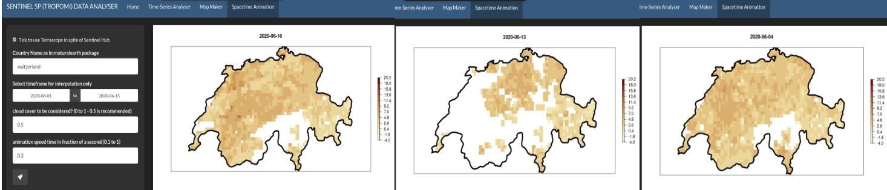

# UC3 : SENTINEL 5P DASHBOARD


An RShiny application to visualise satellite time-series of Sentinel 5P data making use of openEO Platform. There are options for plotting a time-series, a raster of snapshot and creating a spacetime animation. This document should guide on the usage and **installation** of the RShiny application, but shall also guide the creation of new RShiny applications making use of openEO platform toolbox. 

## User Guide

### How to use this RShiny application

For the time being, this RShiny was designed to run locally, under the recommendation of using RStudio. Therefore, the guidance here present demonstrates how does this RShiny application work and how to make it run. It was also designed to serve as a template for future shiny based application using the openEO platform. In a few words, it is mainly meant to drive the creation of other UIs based on shiny and this was lever the use of the openEO platform. For this reason, all the steps are detailed in this README as well as possible, so one can not only reproduce this example, but use it as base for their own ideas. 

As said, it is highly recommended to use RStudio IDE to run this application. Unfortunately, given the fact that it's not possible to login to openEO in a user-less way. Therefore, an interaction with the Console is, at least for now, required. This is so far what is blocking the deployment of the shiny app. 

After cloning this repository, one can open the [main script](app.R) in RStudio and press "Run App" in the upper part of the IDE. This will start the app, and a few minutes later, the user will be prompted to press *Enter* and login through EGI for the openEO platform. It is very important to have access to openEO platform, hence to have already credentials to use it. The [Services provided](https://openeo.cloud/#plans) shall demonstrate the options that fit each user demands. 


Once "Enter" is pressed, a browser window or tab should open guiding the user through the EGI login. The credentials should be passed, and if he user is already logged in, one can simply confirm and agree with the openEO platform requirements by pressing "Yes".


After that, the shiny application shall open and the user should be able to see the following RStudio window. If one prefers, it is also possible to open it in the browser.


As one may see, there are three main tabs in the app, besides the home screen : "Time-Series Analyser", "Map Maker", and "Spacetime Animation". All examples are going to be presented, together with some explanations of the ideas behind them.

### Time-Series Analyser

The Time-Series Analyser allows one to see the "reduced" time series of Sentinel 5P NO2 data from a given region. The source code, outside of the [app](app.R), can be found [here](src/time-series.R). Basically, to use this function, the user can pass the coordinates of the bounding box of the area of interest, which are shown in a dynamic map just below; but also the time frame and the cloud cover to be considered in the computation. This last one refers to the percentage (0 to 1) of values that should be really considered as cloud. It works as a quality flag. The recommendation of ESA and the Sentinel documentation is to use 0.5, the default here.

Once all parameters are set, the user may just press the "Rocket button" to launch results. As default, the application will try to run the process synchronously, if it refers to a small area, and if it fails, it will send it as a job to be queued in a given back end.

The default coordinates will give the user a plot of the Northern Region of Italy, in the region of Bolzano, where some local data is also available for comparison. If the user's bounding box is inside this region, one will always see this data.

It is important to mention that the process can take long, especially for bigger areas. It depends a lot on a series of factors, and even the backend the user is using. The RStudio Console should give a hint of how the process is going. It check the status of the back-end every minute or so.


### Map Maker for one Snapshot

If the user desires to look at NO2 data at one given point in time, this function is the developed for this purpose. This second option in the shiny app allows one to visualise how does a country's pattern in NO2 looks like in a given time, following S5P NO2 data. 

The parameters present are the date for the snapshot, the cloud cover quality flag, and the country name. Here, the bounding box could have been an option as well, but so far the idea is just to demonstrate the different options available.


### Spacetime Animation



Here, the user can create and visualise their own spatio-temporal animation of S5P NO2 data. Given a starting and ending date, as well as the quality flag for cloud cover and a given country name, the user may have their own personalised spacetime GIF ready for their usage. 


## Behind the Scenes

### Time Series Analyser

In order for getting a deeper understanding about what's going on in the background, an explanation about what is going on under the hood follows. Basically, two collections are first loaded, S5P data with NO2 band and also Cloud Cover band. In the following, a mask is passed to the NO2 values. This means that, where a cloud is defined (considering the quality flag), no data is assigned as the pixel value in the datacube. This happens to leave the datacube with holes in it, which are filled through an interpolation process in the sequence. Once this is done, a spatial reduction and an aggregate are applied to the datacube using the mean and maximum values. As mentioned, if the study area is small enough, a synchronous process is tried, and if it doesn't work, usually due to a time-out, the process is sent to be queued in the back-end. 

Once that is done, that data shall come as a JSON for download, which is automatically read by the shiny app. A smoothing is applied to the data, so it is better looking and more comprehensible, and to also compare it to a moving average still being applied as a User Defined Function (UDF).


### Map Maker for one Snapshot

Before anything else, the one may find [here](src/map-maker.R) the source of the map maker outside of shiny. For creating a plot of a snapshot of NO2 data, the process is quite similar to the time-series analyser. Although, in spite of aggregating the data and reducing the spatial dimensional, with the interpolated data one simply applies a temporal filter, and data is downloaded as GeoTiff in spite of JSON. An example of the process graph can be seen below :


### Spacetime Animation

Finally, in order to explain how does the [spacetime animation](src/spacetime-animation.R) works, some steps are taken similarly as in the "Map Maker", ending by the interpolation, although no other processes are applied after that. The images are simply downloaded in the time series as PNGs and [gifski](https://cran.r-project.org/web/packages/gifski/index.html) is used to join them into one GIF file. 


## How to run openEO processes inside an RShiny APP?

As any other rshiny application, a ui and a server are required. The UI script made for the "Time Series Analyser" script can be seen below. 

```R
 # Application title
    tabPanel( title = "Time-Series Analyser", value = "tab2",

    # Sidebar with a slider input for number of bins
    sidebarLayout(
        sidebarPanel(
          numericInput("w", "xmin (EPSG:4326)", 10.35, min = 0, step = .01),
          numericInput("s", "ymin (EPSG:4326)", 46.10, min = 0, step = .01),
          numericInput("e", "xmax (EPSG:4326)", 12.55, min = 0, step = .01),
          numericInput("n", "ymax (EPSG:4326)", 47.13, min = 0, step = .01),

          # dynamic bbox
          leafletOutput("mymap"),

          # Select time gap
          dateRangeInput("date1date2", "Select timeframe", start = "2019-01-01", end = "2019-01-31",
                         min = "2019-01-01", max = "2020-12-31", startview =  "year", weekstart = "1"),

          numericInput("cloud", "cloud cover to be considered? (0 to 1 - 0.5 is recommended)", 0.5, min = 0, max = 1, step = .1),

          #submit button
          actionButton(inputId = "data1", label = icon("rocket")),
        ),

        # Show a plot of the time series
        mainPanel(
           plotOutput("timeseries")
        )
      )
    ),
```

Here, it is first defined the "sidebar Panel", which includes all the parameters necessary for the Time-Series Analyser. The first of those are the bounding box coordinates and they are all defined as *numericInput*. As the coordinates draft the leaflet dynamic map, here in the ui, it is needed to simply call the *leafletOutput*, which shall be defined in the server side. After that, the *dateRangeInput* is defined, which allows for this appealing way of calling the starting and ending dates. Another *numericInput* also adds the quality flag value for cloud cover. Something else setup here was the *actionButton()*, which forces the script in the server to run only when it has been clicked. This is crucial as the whole processes can take a while and therefore changing the values on-the-fly would not be feasible. It is really important nice one can add many different icons to the action button, and for this case, the rocket icon was picked, as one can see. Finally, the *plotOutput* is added to the mainPanel and that finishes the definition of the UI side of shiny app.

In the server side, as the algorithm has already been explained before, it will be shown how shall one with the inputs from the UI, which is what is the most relevant when working with shiny. 

```R
  # plot bbox
  output$mymap <- renderLeaflet({
    coords_df = data.frame(lon = c(input$w, input$e), lat = c(input$s, input$n)) %>%
      st_as_sf(coords = c("lon", "lat"), crs = 4326) %>%
      st_bbox() %>%
      st_as_sfc

    lon = coords_df %>% st_centroid() %>% st_coordinates() %>% as_tibble() %>%
      pull(X) %>% unlist() %>% as.numeric()

    lat = coords_df %>% st_centroid() %>% st_coordinates() %>% as_tibble() %>%
      pull(Y) %>% unlist() %>% as.numeric()

    leaflet(coords_df) %>%
      addTiles(group = "OpenStreetMap") %>%
      setView(lng = lon, lat = lat, zoom = 20) %>%
      fitBounds(input$w, input$s, input$e, input$n) %>%
      addPolygons(data = coords_df)

  })
```

So, here it is demonstrated how the leaflet dynamic map of the bounding box is created. First of all, the *sf* package is used to create a bounding box (*bbox()*) out of the coordinates defined in the UI; then the coordinates are once again extracted from this *sf* object so they can be added to function call of the leaflet() function. The view is set to the centroid of the created polygon and a special trick is the *fitBounds()* function, which allows the map to be always inside the visual panel. 

After that, the coordinates, the quality flag and the timestamps for the main algorithm are stored :

```R
output$timeseries <- renderPlot({
      if (input$data1 == 0) return()
      input$data1
      w = input$w
      s = input$s
      e = input$e
      n = input$n
      date1 = input$date1date2[1]
      date2 = input$date1date2[2]
      cloud = input$cloud
```
After that, the algorithms are written inside the rshiny app. Those have been already explained before. For the "Map Maker", the main difference is that a bounding box is not defined, but the input is *textInput()* of the country of interest. One can check the differences below :

```R
 tabPanel( title = "Map Maker", value = "tab3",
              sidebarLayout(
                sidebarPanel(
                  textInput("country", "Country Name as in rnaturalearth package", value = 'switzerland'),


                  # Select time gap
                  dateRangeInput("datedate12", "Select timeframe for interpolation only", start = "2018-01-01", end = "2021-12-31",
                                 min = "2018-01-01", max = "2021-12-31", startview =  "year", weekstart = "1"),

                  dateInput("date", "Select date for the plot", min = "2018-01-01", max = "2021-12-31", startview =  "year", weekstart = "1"),

                  numericInput("cloud", "cloud cover to be considered? (0 to 1 - 0.5 is recommended)", 0.5, min = 0, max = 1, step = .1),

                  #submit button
                  actionButton(inputId = "data2", label = icon("rocket")),
                ),

                # Show a plot of the generated distribution
                mainPanel(
                  plotOutput("mapmaker")
                )
                ) #sidebar
              ),#tabpanel
```

The server side of the "Map Maker" then has a very similar composition as the "Time Series" one, although in this situation, one works with the text (string) of the country.

```R
 output$mapmaker <- renderPlot({
        if (input$data2 == 0) return()
        input$data2
        # user inputs
        country = input$country
        date1 = input$datedate12[1]
        date2 = input$datedate12[2]
        cloud = input$cloud
        date = input$date
```

For the spacetime animation, the only different parameter is the delay, which is actually a parameter of the gifski function being used. This is used as way to control how fast the animation should run. 

```R
numericInput("delay", "animation speed time in fraction of a second (0.1 to 1)", 0.3, min = 0.1, max = 1, step = .1),
```

Moreover, as one can imagine, the server then calls this value (*numericInput()*) as it does with all the others as well. 

```R
 if (input$data3 == 0) return()
        input$data3
```
 Although, the most interesting part here is that the figure outputted by the algorithm is rendered, so the user can see the animation (the GIF) in the shiny APP itself. The UI reference for the following renderer is a simple *plotOutput()* as well. 
 
```R
output$animation <- renderImage({
    filename <- normalizePath(
         file.path('./image',
             paste('spacetime-animation',
                '.gif', sep='')))
```
 
 
## User Defined Function (UDF)

A user defined function (UDF) has also been defined for this project. This is one of the greatest advantages, if not the greatest, of using openEO, and this dashboard shall also be made use of, for also demonstrating how to implement a UDF, and more especially, now inside a shiny app. 


The UDF defined for this rshiny app is a Moving Average one with 30 days window size. The UDF is defined as [a python script](src/udf.py) with a simple implementation of a moving average. In order to call the UDF python script, one basically needs to make use of the process called *run_udf()*, as below :

```R
     # moving average UDF
      ma <- function(data, context){
        p$run_udf(data = data, udf = readr::read_file("src/udf.py"),
                  runtime = "Python"
        )
      }

      datacube_ma = p$apply_dimension(process = ma,
                                      data = datacube, dimension = "t"
      )
```

As one can see, the python script is read as a string, using the r package *readr*. For now, the window of the moving average is hard coded, given issues in the back-end, but this is also something that shall be fixed soon. 


## Terrascope and SentinelHub

There's a check box in the beginning of every page of the RShiny. This check box refers to the use of Terrascope. As mentioned, before, the whole script is based on the use of Sentinel Hub, although this option has been very slow and if the user just wants to have a quick check on the dashboard (as a dashboard, it should also be quicker), he/she can use Terrascope's data. The only problem with Terrascope data is that there is no quality flag there to be used. The data for NO2 in S5P are already pre-processed. The good and interesting side of this is that another input for the shiny app had been added due to that reason. The *checkboxInput()*, which basically delivers a logical/boolean value, is finally used to define *load_collection()* processes later, setting it to load Terrascope collections (if ticked) or Sentinel Hub ones. . 

## Benchmarking

As usual, it's relevant to add some benchmarking comparing running the Moving Average in the backend and running it locally. The openEO moving average example was already explained above, and the local one is a function using *st_apply()* and the *stars* package. The access to the whole comparison script is [here](src/benchmarking.R) given. 

It's important to mention that this is complicated to estimate once it's not possible to access the log files of vito's backend (the one used for this use case) so easily. Nevertheless, a rough estimate comparing that could be potentially interesting for users to better understand the capabilities of openEO. Therefore, it was ran two comparisons in two different regions, being one small, Switzerland, and the other, much bigger, the whole Europe. This was done for the whole year of 2019 using Terrascope S5P data. The first comparison was a very simple one, taking into account the downloading time to obtain GeoTiffs. 

It is important to mention that the Download internet speed used for the tests was around 30 Mgbts. The local moving average, which speed depends on the local computational power, was ran on a intel7 (7th generation), 16GB RAM, 4th cored Linux (Ubuntu 22.04) Notebook. 

The second way to keep with the comparison was to check the time to run the local and backend's moving average separately. Locally, this is very simple to test. In the backend, this is tricky. What was done there was to check the job was registered as "running", and register the time, and when it got finished, the time was registered again. It is important to say that the status of the job was checked every 30 seconds, so there is a considerable error margin of approximately 2 minutes, which is the sum of four runs required to download the data. 

When running for country of Switzerland, it was found that the local stars moving average did the entire process, including downloading time, in 21 minutes, and the run of the stars script only, in 7 seconds. In vito's backend, the whole process took approximately 26 minutes, and the moving average itself 4 minutes. As mentioned, this is a very small cube, and when looking at performance, openEO might seem not so efficient. Although, the question that remains is how to download the data so easily ? For that reason, even with small datasets, openEO is still very relevant. 

When the entire Europe is used as reference, the panorama swiftly changes. This get much more interesting for the openEO users. Unless one has access to much more RAM in their PC, it is highly doubted one could make it run locally. This test will break almost any standand notebook around. In openEO, in the other hand, it does not only run, but it also does the job in 27 minutes (in roughly 5 minutes, if only the UDF is considered). 

## Dependencies

* R 4.2.1 "Funny Looking Kid"" x86_64, linux-gnu
* RStudio : 2022.07.01

all packages and versions :

* shiny 1.7.1
* shinythemes 1.2.0
* openeo 1.2.1
* raster 3.5-15
* sf 1.0-8
* geojsonsf 2.0.2
* rjson 0.2.21
* ggplot2 3.3.6
* rnaturalearth 1.0.1
* gifski 1.6.6-1
* magick 2.7.3
* ggvis 0.4.7
* leaflet 2.1.1
* dplyr 1.0.10
* readr 2.1.2

