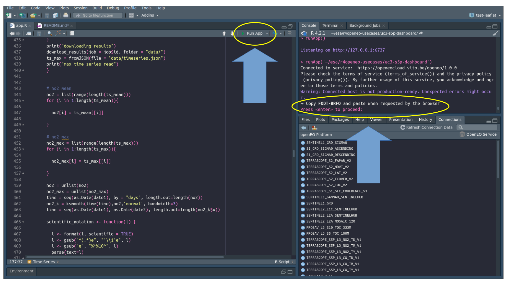
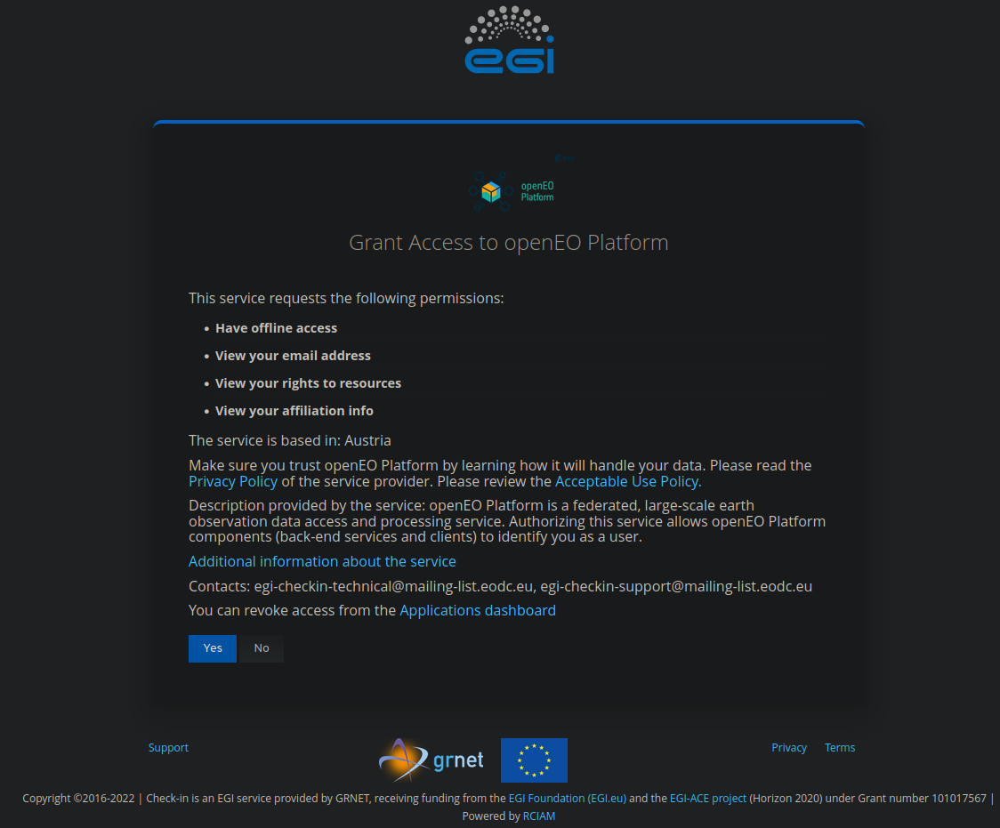
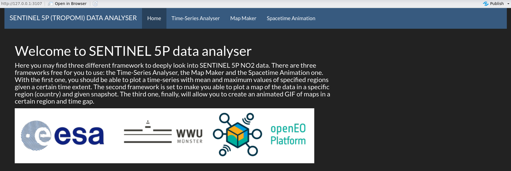
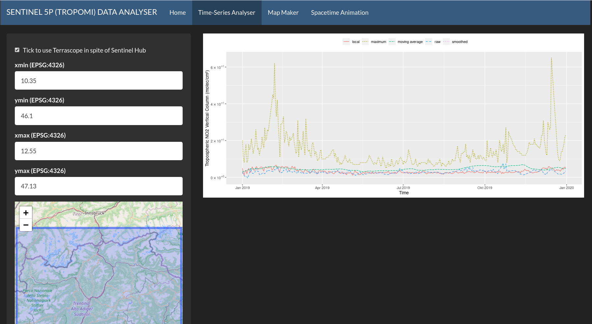
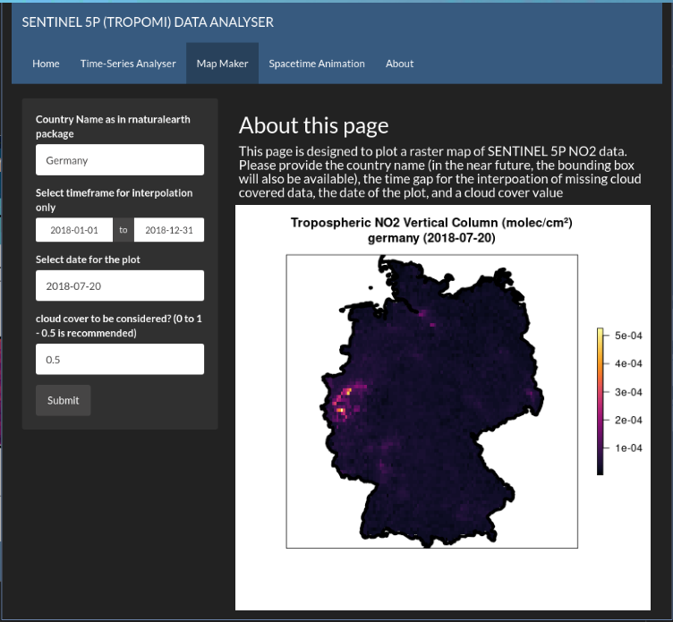
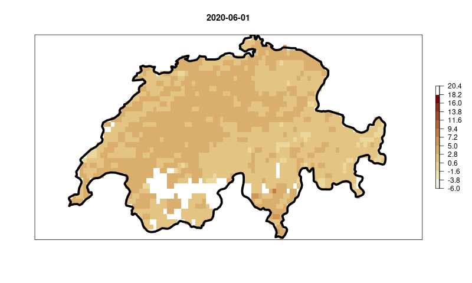

# UC3 : SENTINEL 5P DASHBOARD

An RShiny application to visualise satellite time-series of Sentinel 5P data making use of openEO Platform. There are options for plotting a time-series, a raster of snapshot and creating a spacetime animation. This document should guide on the usage and **installation** of the RShiny application, but shall also guide the creation of new RShiny applications making use of openEO platform toolbox. 

## User Guide

### How to use this RShiny application

This RShiny was designed to run locally, under the recommendation of using RStudio. Therefore, the guidance here present demonstrates how does this RShiny application work and how to make it run. It was also designed to serve as a template for future shiny based application using the openEO platform. In few words, it is mainly meant to drive the creation of other UIs based on shiny and this was lever the use of the openEO platform. For this reason, all the steps are detailed in this README as well as possible. So you can not only reproduce this example, but use it as base for your own ideas. 

As said, it is highly recommended to use RStudio IDE to run this application. Unfortunately, given the fact that it's not possible to login to openEO in a user-less way. Therefore, an interaction with the Console is, at least for now, required. 

After cloning this repository, you may open the [main script](app.R) in RStudio and press "Run App" in the upper part of the IDE. This will start the app, and a few minutes later, it will ask you to press Enter and login through EGI for the openEO platform. It is very important you have access to openEO platform, so you have already credentials to use it. Take a look at the [Services provided](https://openeo.cloud/#plans) and take an option that fits you the best. 

Once you press "Enter", a browser windows or tab should open guiding you through the EGI login. Pass on you credentials, and if you're already logged in, you can simply confirm you agree with the openEO platform requirements by pressing "Yes".

After that, the shiny application shall open and you should be able to see the following RStudio window. If you prefer, you can also open it in your browser.

As you may see, there are three main tabs in the app, besides the home screen : "Time-Series Analyser", "Map Maker", and "Spacetime Animation". We're going to go through examples of all of them, together with some explanations of the ideas behind them.

### Time-Series Analyser

The Time-Series Analyser allows you to see the "reduced" time series of Sentinel 5P NO2 data from a given region. The source code, outside of the [app](app.R), can be found [here](src/time-series.R). Basically, to use this function, the user can pass the coordinates of the bounding box of the area of interest, which are shown in a dynmaic map just below; but also the time frame and the cloud cover to be considered in the computation. This last one refers to the percentage (0 to 1) of values that should be really considered as cloud. It works as a quality flag. The recommendation of ESA and the Sentinel documentation is to use 0.5, our default here.

Once all parameters are set, you may just press the "Rocket button" to launch results. As default, the application will try to run the process synchronously, if it refers to a small area, and if it fails, it will send it as a job to be queued in a given back end.

The default coordinates will give you a plot of the Northern Region of Italy, in the region of Bolzano, where we also have some local data for comparison. If your bounding box is inside this region, you'll always see this data, otherwise, you shall see only S5P data.

It's important to mention that the process can take long, especially for bigger areas. It depends a lot on a series of factors, and even the backend you're using. The RStudio Console should give you a hint of how the process is going. It check the status of the backend every minute or so.

### Map Maker for one Snapshot

If your desire is to look at NO2 data at one given point in time, this function in the one you're probably looking for. This second option in the shiny app allows one to visualise how does a country's pattern in NO2 looks like in a given time, following S5P NO2 data. 

The parameters present are the date for the snapshot, the cloud cover quality flag, and the country name. Here, the bounding box could have been an option as well, but so far the idea is just to demonstrate the different options available.

### Spacetime Animation

The spacetime animation option is, to be honest, the funniest of the functions available in the app. Here you can create and visualise your own spatiotemporal animation of S5P NO2 data. Given a starting and ending date, as well as the quality flag for cloud cover and a given country name, you may have your own personalised spacetime GIF ready for your usage. 

## Behind the Scenes

### Time Series Analyser

In order for you to also understand what's going on in the background, we should also explain a little bit about what's going on under the hood. Basically, we first load two collections, S5P data with NO2 band and also Cloud Cover band. In the following, we pass a mask to the NO2 values. This means that, where a cloud is defined (considering the quality flag), no data is passed as the pixel value in the datacube. This happens to leave the datacube with holes in it, which we fill using an interpolation process in the sequence. Once this is done, we reduce the aggregate the datacube spatially using the mean and maximum values. As mentioned, if the study area is small enough, a synchronous process is tried, and if it doesn't work, usually due to a time-out, the process is sent to be queued in the back-end. 

Once that is done, that data shall come as a JSON for download, which is automatically read by the shiny app. A smoothing is applied to the data, so it's better looking and more comprehensible, and to also compare it to a moving average still being applied as a User Defined Function (UDF).

### Map Maker for one Snapshot

Before anything else, you may find [here](src/map-maker.R) the source of the map maker outside of shiny. For creating a plot of a snapshot of NO2 data, the process is quite similar to the time-series analyser. Although, in spite of aggregating the data and reducing the spatial dimensional, with the interpolated data we simply apply a temporal filter, as we download the data as a GeoTiff is spite of JSON. An example of the process graph can be seen below :

### Spacetime Animation

Finally, in order to explain you how does the spacetime animation works, we do same steps as in the map maker, ending by the interpolation, although no other processes are applied after that. We simply download all images in the time series as PNGs and we use [gifski](https://cran.r-project.org/web/packages/gifski/index.html) to join them into one GIF file. 

## Dependencies

* R 4.2.1 "Funny Looking Kid"" x86_64, linux-gnu
* RStudio : 2022.07.01
* all packages and versions
* shiny 1.7.1
* shinythemes 1.2.0
* openeo 1.2.1
* raster 3.5-15
* sf 1.0-8
* geojsonsf 2.0.2
* rjson 0.2.21
* ggplot2 3.3.6
* rnaturalearth 1.0.1
* gifski 1.6.6-1
* magick 2.7.3
* ggvis 0.4.7
* leaflet 2.1.1
* dplyr 1.0.10

